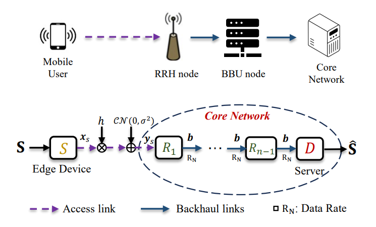

# h-DJSCC: Deep Joint Source-Channel Coding for Hybrid Mobile Multi-hop Networks

This repository contains the source code for the paper:

> **A Deep Joint Source-Channel Coding Scheme for Hybrid Mobile Multi-hop Networks**  
> *Chenghong Bian, Yulin Shao, Deniz Gunduz*  
> Published in IEEE Journal on Selected Areas in Communications (JSAC), 2025  
> [IEEE Xplore Link](https://ieeexplore.ieee.org/document/10960356)

---

## Overview

**h-DJSCC** introduces a novel Deep Joint Source-Channel Coding (DJSCC) framework tailored for C-RAN (cloud radio access network). The key innovation is to efficiently and effectively convert the analog DeepJSCC codewords into bit sequences to be transmitted over the fibers/backhaul links.




Key features include:

- **DeepJSCC codeword Compression**: Instead of naive vector quatization schemes, we consider learning based image compression [algorithm](https://arxiv.org/abs/1802.01436) to compress the analog DeepJSCC codewords.
- **SNR-adaptive**: SNR-adaptive transmission for DeepJSCC has been introduced in the [literature](https://ieeexplore.ieee.org/document/9438648), yet how to seamlessly combine it with the compression module is unexplored.
- **Variable rate compression**: To achieve different rate-distortion trade-offs using a single model, we consider using the technics in the image compression [literature](https://ieeexplore.ieee.org/document/9578818).


---

## Repository Structure

- `dataset.py`: Handles data loading and preprocessing for CIFAR10 and CelebA datasets.
- `entropy_models.py`: Compression modules copied from the [CompressAI](https://github.com/InterDigitalInc/CompressAI).
- `get_args.py`: Hyper parameters for the h-DJSCC framework.
- `modules.py`: DeepJSCC encoder and decoders.
- `models/`: The folder for the checkpoints.
- `multihop_full_adapt.py`: Implementations for h-DJSCC framework which integrates both DeepJSCC and fully-adaptive compression models.
- `run_full_finetune_hyper.py`: Script for training and evaluating the h-DJSCC model.
- `utils.py`: Utility functions.

---

## Getting Started

### Training 

To train the h-DJSCC model over AWGN and fading channel (with CSIT):

```bash
python run_full_finetune_hyper.py --resume False --fading False --snr_min 1 --snr_max 9
python run_full_finetune_hyper.py --resume False --fading True --snr_min 5 --snr_max 15
```

Also adjust the variable `lamdas` in the `run_full_finetune_hyper.py` file as needed.

### Evaluation

After training, evaluate the model's performance for the AWGN channel:

```bash
python multihop_full_adapt.py --resume True --fading False --snr_min 1 --snr_max 9
```
### Checkpoints

Download some trained models from the google drive [link](https://drive.google.com/drive/folders/1i1YgDB3ELeRtgoWkJZ38IqJSzxdI7JO_?usp=drive_link). Place it under the `models/` folder.

## Citation

If you find this work useful in your research, please cite:

```bibtex
@article{hdjscc,
  title={A Deep Joint Source-Channel Coding Scheme for Hybrid Mobile Multi-hop Networks},
  author={Bian, Chenghong and Shao, Yulin and Gunduz, Deniz},
  journal={IEEE Journal on Selected Areas in Communications},
  year={2025},
  volume={43},
  number={5},
  pages={1234--1245},
  doi={10.1109/JSAC.2025.10960356}
}
